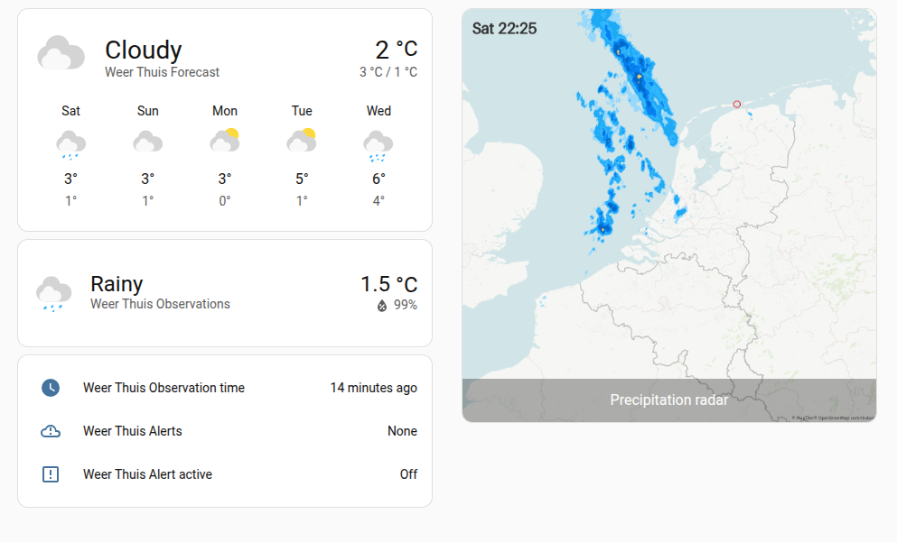
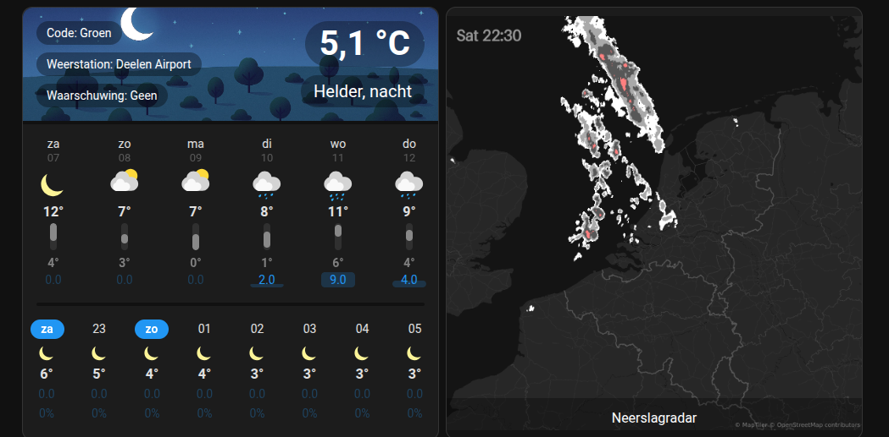

# NL Weather

**NL Weather** is a Home Assistant integration that provides weather forecasts, observations, 
precipitation (e.g. rain) radar and warnings in The Netherlands — using open data directly fetched from 
KNMI (the Royal Netherlands Meteorological Institute).

_Using default cards and radar in bright color theme_

_In this screenshot the custom card [Weather Forecast Extended](https://github.com/Thyraz/weather-forecast-extended) 
is used to display the forecast, warnings and observations. For the radar image the “Picture with entity” card is used._ 

## Features

- Integration as a Home Assistant `weather` entity provider
  - Observations and forecast separated into two `weather` entities
- Can have multiple configurable locations (limited to the Netherlands) with
  - Current weather observations (temperature, humidity, wind, etc.)  
  - Weather forecast (hourly/daily)
  - Weather alerts (issued by KNMI)
- Precipitation / rain radar and forecast (rain intensity, movement, etc.)
  - Can mark home location on the radar image
  - Radar has a dark and light color theme 
- Weather observations fetched from closest KNMI automatic weather station
- Data fetched directly from official KNMI APIs
  - Requires account at KNMI Data Platform
  - Uses KNMI's MQTT Notification Service to reduce polling

## Installation

### Via HACS (recommended)

1. Ensure you have [HACS](https://www.hacs.xyz/) installed in your Home Assistant.
4. Search for **NL Weather** and install.  
5. Restart Home Assistant if required.  

### Manual Installation

If you prefer manual install (or HACS is not available):

1. Download or clone this repository.  
2. Copy the folder `custom_components/nl_weather` to your Home Assistant `custom_components/` directory.  
3. Restart Home Assistant.  
4. Add the integration via **Settings → Devices & Services → Add Integration → NL Weather** 

> ⚠️ If the integration does not show up after installing via HACS or copying manually — try clearing browser cache, 
> restart Home Assistant again, and verify that the folder structure is correct (i.e. `custom_components/nl_weather/…`).

## Configuration

After adding the integration you'll first need to configure your API keys.

### Step 1. Connect to KNMI Data Platform APIs

You can get API keys from https://developer.dataplatform.knmi.nl/. Register an account and request keys for:

1. EDR API
2. Web Map Service (WMS)
3. Notification Service

You'll receive copies of all keys via e-mail as well. 

> ⚠️ The API keys you receive look very similar for all services. This is correct. The end and beginning of the keys will be the same, but the middle does differ. 

### Step 2. Configure a weather location 

To start receiving weather observations and forecasts, add a location: 
**Settings → Devices & services → NL Weather → Add location**

Enter (or modify) your location. The region you set will determine for which region you will receive 
weather alerts.

## Entities Created

The integration will add `weather.weer_thuis_observations` and `weather.weer_thuis_forecast`, plus optional sensor 
entities for detailed data such as:

- Weather warnings
  - Color code
  - Text description
- Distance to weather station
- Name of weather stations

This allows you to use the data in automations, dashboards (Lovelace), and scripts just like with any other weather integration.

## Contributing

Contributions, bug reports, feature requests are welcome. Feel free to open an issue or submit a pull request.  

## License

Apache License, Version 2.0 

## Disclaimer / Notes

- Forecast, weather observations, radar and weather warnings provided by Koninklijk Nederlands Meteorologisch Instituut (KNMI) 
licensed under CC-BY 4.0 
 
## Discussion

For further help or discussion you can use 
[this Home Assistant Community Forum thread](https://community.home-assistant.io/t/nl-weather-integration-forecast-observations-rain-radar-and-warnings/967610).

---

Thank you for using **NL Weather**! If you like it, please consider starring the repo ⭐  

