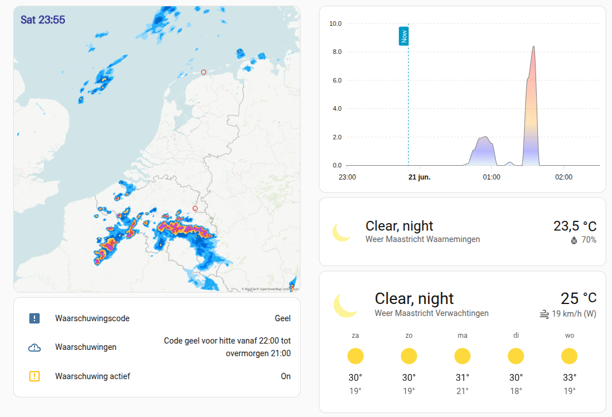
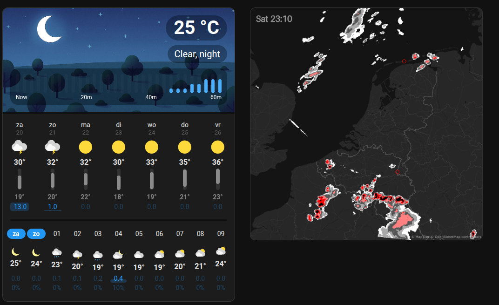
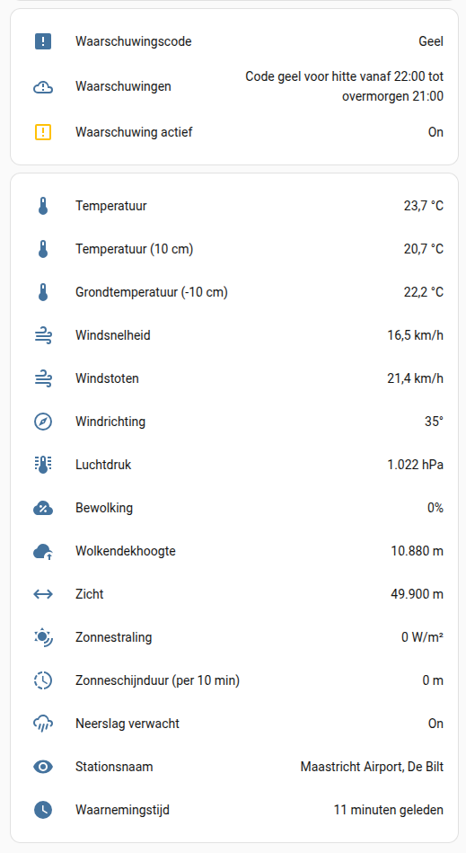
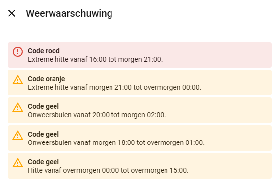
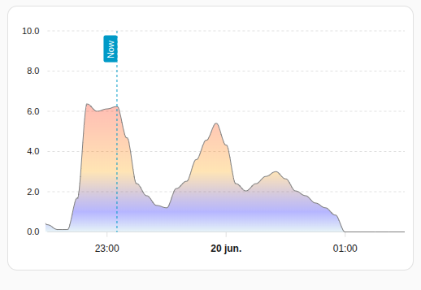
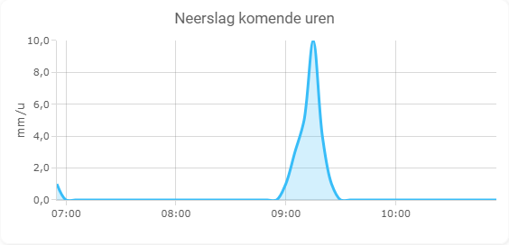

# NL Weather


**NL Weather** is a Home Assistant integration that provides weather forecasts, observations, 
precipitation (e.g. rain) radar, precipitation nowcast graph and warnings in The Netherlands — using open data 
directly fetched from KNMI (the Royal Netherlands Meteorological Institute).



_Using default cards and radar in bright color theme. Nowcast graph plotted using ApexCharts_



_In this screenshot the custom card [Weather Forecast Extended](https://github.com/Thyraz/weather-forecast-extended) 
is used to display the forecast and nowcast. For the radar image the “Picture with entity” card is used._ 

## Features

- Integration as a Home Assistant `weather` entity provider
  - Observations and forecast separated into two `weather` entities
- Can have multiple configurable locations (limited to the Netherlands) with
  - Current weather observations (temperature, humidity, wind, etc.)  
  - Weather forecast (hourly/daily)
  - Weather alerts (issued by KNMI)
- Precipitation / rain radar and forecast graph
  - Can mark home location on the radar image
  - Radar has a dark and light color theme 
  - Precipitation nowcast and binary sensor when precipitation is predicted
- Weather observations can be fetched in two modes
  1. Manually select a weather station
  2. Automatically fetch the closest observations from one or more weather station
- Data fetched directly from official KNMI APIs
  - Requires account at KNMI Data Platform
  - Uses KNMI's MQTT Notification Service to reduce polling

## Installation

### Via HACS (recommended)

1. Ensure you have [HACS](https://www.hacs.xyz/) installed in your Home Assistant.
2. Search for **NL Weather** and install.  
3. Restart Home Assistant if required.

### Manual Installation

If you prefer manual install (or HACS is not available):

1. Download or clone this repository.  
2. Copy the folder `custom_components/nl_weather` to your Home Assistant `custom_components/` directory.  
3. Restart Home Assistant.

## Configuration

After adding the integration you'll first need to configure your API keys.

### Step 1. Connect to KNMI Data Platform APIs

You can get API keys from the [KNMI Developer Portal](https://developer.dataplatform.knmi.nl/). Register an account by sending an e-mail to KNMI (read this [FAQ](https://developer.dataplatform.knmi.nl/faq#signup)).

1. EDR API
2. Web Map Service (WMS)
3. Notification Service

Be sure to write down the keys correctly, you will only be able to see them once. There is no way to revoke them after requesting them.

> [!IMPORTANT]
> The API keys you receive look very similar for all services. This is correct. The end and beginning of the keys will be the same, but the middle does differ. 

### Step 2. Add the integration and enter your API keys
Add the integration via **Settings → Devices & Services → Add Integration → NL Weather** 

> [!TIP]
> If the integration does not show up after installing via HACS or copying manually — try clearing browser cache, restart Home Assistant again, and verify that the folder structure is correct (i.e. `custom_components/nl_weather/…`).

A form is shown where you can enter your API keys for:

1. EDR API
2. Web Map Service (WMS)
3. Notification Service (MQTT)

### Step 3. Configure a weather location 

To start receiving weather observations and forecasts, add a location: 
**Settings → Devices & services → NL Weather → Add location**

Enter (or modify) the GPS coordinates of your location. The region you set will determine for which region you will receive weather alerts.

## Usage

The integration creates the following entities for each configured location:

### Weather entities

- `weather.weer_{location}_observations` for current weather observations
- `weather.weer_{location}_forecast` for the weather forecast
  - This entity also supports the service call `get_minute_forecast` to get the precipitation nowcast.

### Sensor entities



- Weather alert text and alert level
- Forecast temperature sensors for today's and tomorrow's highs and lows
- Precipitation forecast binary sensor 
  - Nowcast graph data stored as a sensor attribute `forecast` (in mm/h)
- Heat force index (hittekracht) for now and today
  - Index of the Wet Bulb Globe Temperature.
  - See https://www.knmi.nl/kennis-en-datacentrum/uitleg/hittekracht
  - These are forecasted values and not based on measurements
- Observations
  - Temperature (air at 1.5 m and 10 cm and soil at -10 cm)
  - Relative humidity
  - Dew point
  - Visibility
  - Air pressure at mean sea level
  - Wind speed
  - Wind gusts
  - Wind direction (in degrees and cardinal)
  - Cloud coverage
  - Cloud ceiling
  - Sunshine duration
  - Solar radiation 
- Observation time, station distance, and station name as diagnostic sensors

Available observation sensors depend on the selected weather station. Airport stations usually provide the most complete set of measurements. More information about observations can be found in [KNMI documentation](https://english.knmidata.nl/open-data/10-minute-in-situ-meteorological-observations).

### Rendering weather alerts

The weather alert sensor exposes the first active alert as its state. All active alerts are also available in the `alerts` attribute as dictionaries with `code` and `description`.

This markdown card renders every active alert as a separate Home Assistant alert block:

```yaml
type: markdown
content: |
  
  
  
  
  
  
  
  
  
  
  
  <ha-alert alert-type="{{ level }}" title="{{ title }}">
    {{ detail[:1] | upper }}{{ detail[1:] }}{{ '.' if not detail.endswith('.') else '' }}
  </ha-alert>
  
  
  <ha-alert alert-type="info" title="Weerwaarschuwing">
    Geen actieve weerwaarschuwingen.
  </ha-alert>
  
```



### Which weather station is being used?

When using automatic station selection, observation values can come from multiple nearby stations (per parameter). In that case:

- Station name shows all contributing stations, ordered by how often they were used
- Station distance shows the distance that was used most often
- Observation time shows the most frequent observation timestamp among contributing stations

This allows you to use the data in automations, dashboards, and scripts just like with any other weather integration. The name(s) of the station(s) in use is available as diagnostic sensor.

### Rendering the precipitation nowcast graph

Home Assistant lacks a way to directly render the precipitation nowcast graph.
The data for the graph is available in two ways:

1. As service call `get_minute_forecast` to the `weather.weer_{location}_forecast` entity.
    - This has been pruned to only include data from now onwards.
    - At a minute interval
2. As `forecast` attribute to the `sensor.weer_{location}_precipitation_forecasted` sensor.
    - Use the HA Developer Tools to inspect the sensor
    - This contains also data from the past
    - At a 5 minute interval, as the API provides.

There are a few good ways to render a graph from this.

1. Using [Weather Forecast Extended](https://github.com/Thyraz/weather-forecast-extended), 
which makes use of the `get_minute_forecast` service. Refer to the configuration of that card, how to setup the nowcast entities. 
2. Making use of [ApexCharts Card](https://github.com/RomRider/apexcharts-card) and render the data from the sensor. This is an example configuration:

```yaml
type: custom:apexcharts-card
experimental:
  color_threshold: true
graph_span: 3h
span:
  start: hour
  offset: "-30m"
yaxis:
  - max: ~10
now:
  show: true
  label: Now
series:
  - entity: binary_sensor.weer_home_precipitation_forecasted
    unit: mm/h
    type: area
    opacity: 0.3
    stroke_width: 1
    color: gray
    color_threshold:
      - value: 0
        color: lightblue
      - value: 1
        color: blue
      - value: 3
        color: orange
      - value: 7
        color: red
    data_generator: |
      const data = entity.attributes.forecast || [];
      return data.map(p => [
        new Date(p.datetime).getTime(),
        p.precipitation ?? 0
      ]);
```

To make something like this:



3. Making use of [Plotly Graph Card](https://github.com/dbuezas/lovelace-plotly-graph-card) and render the data from the sensor. This is an example configuration:

```yaml
type: custom:plotly-graph
title: Precipitation nowcast
fn: |
  $fn ({ hass, vars }) => {
    const forecast = hass.states['binary_sensor.weer_home_precipitation_forecasted']?.attributes?.forecast || [];

    vars.x = forecast.map(p => new Date(p.datetime).getTime());
    vars.y = forecast.map(p => p.precipitation ?? 0);
  }
layout:
  yaxis:
    title:
      text: mm/h
    rangemode: tozero
  xaxis:
    tickformat: "%H:%M"
config:
  displayModeBar: false
entities:
  - entity: ""
    name: Precipitation
    x: $ex vars.x
    "y": $ex vars.y
    type: scatter
    mode: lines
    fill: tozeroy
```

To make something like this:



### Creating a precipitation forecasted sensor with a custom threshold

The default `sensor.weer_{location}_precipitation_forecasted` will trigger at any precipitation (e.g 0.1 mm/h). If you like a higher threshold, you can add this templated binary sensor in your `configuration.yaml`:

```yaml
template:
  - binary_sensor:
      - name: "Precipitation forecasted (2 mm/h threshold)"
        unique_id: weer_home_precipitation_forecasted_threshold
        state: >
          
          
          
          
          
            
              
            
          
          {{ ns.rain }}
```

## Contributing

Contributions, bug reports, feature requests are welcome. Feel free to open an issue or submit a pull request.  

## License

Apache License, Version 2.0 

## Disclaimer / Notes

- Forecast, weather observations, radar and weather warnings provided by Koninklijk Nederlands Meteorologisch Instituut (KNMI) 
licensed under CC-BY 4.0 
 
## Discussion

For further help or discussion you can use 
[this Home Assistant Community Forum thread](https://community.home-assistant.io/t/nl-weather-integration-forecast-observations-rain-radar-and-warnings/967610).


---

Thank you for using **NL Weather**! If you like it, please consider starring the repo ⭐  
